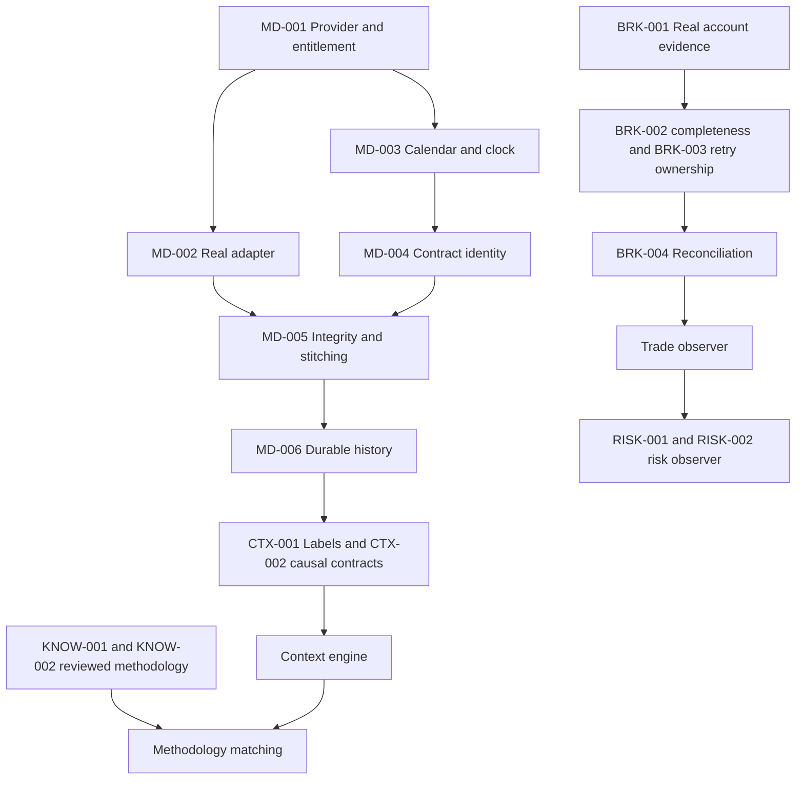

# Technical gap register — Phase 10.5

Baseline `d1c23d4`, audited 2026-09-20. All entries OPEN. No gap was closed by merely documenting it. Severity reflects consequence in the stated deployment/phase, not proof of current exploitation. BEFORE PHASE 12 groups methodology prerequisites whose authoritative matching gate is Phase 13; BEFORE PHASE 14 groups prerequisites for subsequent risk observation. LATER / NON-BLOCKING means non-blocking for isolated Phase 11 development, **not** safe to ignore before production. SEC-001 must be addressed before external multi-user exposure of existing AI routes, even though AI expansion remains prohibited.

Evidence paths without a prefix are under `server/src/` unless explicitly tests/scripts/client/JSON. JSON evidence is under `md/audit-evidence/phase10_5/`. Descriptions below state the gap, not a claimed fix.

## BEFORE PHASE 11

### MD-001 — Provider and entitlement decision

- **Category:** Market data
- **Description:** Provider and entitlement decision prevents the required state described below.
- **Current state:** Only LocalCsvProvider is implemented; configured provider none; no real market credentials/access evidence.
- **Required state:** An explicitly selected provider, rights/retention, dated ES coverage, history/backfill, event type/latency and secret provisioning.
- **Evidence:** marketDataService.js; marketData/LocalCsvProvider.js; methodology-metadata.json configuration
- **Severity:** HIGH
- **Blocks:** Real-provider Phase 11 integration
- **Dependencies:** None
- **Proposed resolution:** Document a provider capability/entitlement decision and obtain test access; no vendor selection by assumption.
- **Validation method:** Provider contract/access smoke with sanitized evidence; no credentials committed.
- **Status:** OPEN
- **Notes:** Audit only; no implementation or data repair performed.

## DURING PHASE 11

### MD-002 — External live adapter absent

- **Category:** Market data
- **Description:** External live adapter absent prevents the required state described below.
- **Current state:** No live market streaming or polling adapter; historical CSV works.
- **Required state:** Normalized real feed behind existing provider boundary with bounded retries and rate limits.
- **Evidence:** services/marketData/MarketDataProvider.js; marketDataService.js
- **Severity:** HIGH
- **Blocks:** Phase 11 exit
- **Dependencies:** MD-001
- **Proposed resolution:** Extend provider contracts and add the approved vendor adapter without changing existing consumer semantics.
- **Validation method:** Real-provider contract tests, outage/rate-limit cases and recorded deterministic replay.
- **Status:** OPEN
- **Notes:** Audit only; no implementation or data repair performed.

### MD-003 — Authoritative session calendar and market clock absent

- **Category:** Time
- **Description:** Authoritative session calendar and market clock absent prevents the required state described below.
- **Current state:** Declared calendar windows and central DST normalization exist; no schedule acquisition/clock.
- **Required state:** Versioned authoritative exchange schedules, agreed RTH/ETH semantics, trading dates, holidays/early closes and live freshness clock.
- **Evidence:** marketData/calendar.js; time.js; instrumentSpecificationService.js
- **Severity:** HIGH
- **Blocks:** Phase 11 exit; Phase 12
- **Dependencies:** MD-001
- **Proposed resolution:** Add calendar/clock capability using vetted schedule data; reconcile journal UTC conventions explicitly.
- **Validation method:** Known DST folds/gaps, overnight, maintenance, holiday/early-close fixtures plus authoritative schedule comparison.
- **Status:** OPEN
- **Notes:** Audit only; no implementation or data repair performed.

### MD-004 — Contract identity and rollover policy incomplete

- **Category:** Futures
- **Description:** Contract identity and rollover policy incomplete prevents the required state described below.
- **Current state:** Root specifications may resolve expiry symbols; no active-contract, expiration or continuous-series policy. Backtest rejects root/continuous futures.
- **Required state:** Explicit root vs dated contract vs continuous identity and no silent rollover/price adjustment.
- **Evidence:** instrumentSpecificationService.js futureRoot; backtestService.js executeStrategy
- **Severity:** HIGH
- **Blocks:** Phase 11 contract handling; later multi-contract simulation
- **Dependencies:** MD-001, MD-003
- **Proposed resolution:** Define metadata/resolution and eligibility policy; initially restrict to explicit dated contracts if approved.
- **Validation method:** Contract-boundary, expiry, rollover and adjusted/unadjusted rejection tests.
- **Status:** OPEN
- **Notes:** Audit only; no implementation or data repair performed.

### MD-005 — Live ordering, freshness and stitching missing

- **Category:** Integrity
- **Description:** Live ordering, freshness and stitching missing prevents the required state described below.
- **Current state:** Historical duplicate/OHLC/gap validation only; no live sequence, stale feed, correction or reconnect handling.
- **Required state:** Observable event time/receive time, finality, sequence/dedupe, bounded recovery/backfill and revision provenance.
- **Evidence:** marketData/normalizer.js; CandleCache.js; no live subscription implementation
- **Severity:** HIGH
- **Blocks:** Phase 11 exit
- **Dependencies:** MD-002, MD-003, MD-004
- **Proposed resolution:** Extend canonical event contract; preserve raw inputs and deterministic replay of corrections.
- **Validation method:** Disconnect, duplicate, out-of-order, clock-skew, late-bar, stale-feed and overlap tests; full-session soak.
- **Status:** OPEN
- **Notes:** Audit only; no implementation or data repair performed.

### MD-006 — Durable market history and retention undecided

- **Category:** Storage
- **Description:** Durable market history and retention undecided prevents the required state described below.
- **Current state:** Local CSV and 32MiB process cache; no bar/event warehouse.
- **Required state:** Indexed durable bar revisions and explicit source retention/cost/entitlement policy; tick storage only if justified.
- **Evidence:** marketData/CandleCache.js; LocalCsvProvider.js; models inventory
- **Severity:** HIGH
- **Blocks:** Phase 11 historical replayability
- **Dependencies:** MD-001, MD-005
- **Proposed resolution:** Measure target volume and bar queries; choose initial storage behind existing service, separately evaluate tick/quote retention.
- **Validation method:** Restart/recovery, range/revision lookup, retention and representative-volume benchmarks.
- **Status:** OPEN
- **Notes:** Audit only; no implementation or data repair performed.

### INFRA-001 — Process-local work lacks durable ownership

- **Category:** Jobs
- **Description:** Process-local work lacks durable ownership prevents the required state described below.
- **Current state:** EventEmitter job map/queue, broker timer and email pending set are process-local; scheduler disabled for production multi-instance.
- **Required state:** A deliberate single-owner or leased/durable worker model with retry safety and bounded retention.
- **Evidence:** queue/jobQueue.js; brokerSyncScheduler.js; services/email/delivery.js; config/operations.js
- **Severity:** HIGH
- **Blocks:** Multi-instance live ingestion; production background reliability
- **Dependencies:** MD-001
- **Proposed resolution:** Choose minimal worker ownership/recovery design based on approved deployment; do not introduce an event platform without need.
- **Validation method:** Kill/restart, concurrent-worker, repeated-delivery, drain/deadline and failed-job visibility tests.
- **Status:** OPEN
- **Notes:** Audit only; no implementation or data repair performed.

### INFRA-002 — No live data health or event correlation

- **Category:** Observability
- **Description:** No live data health or event correlation prevents the required state described below.
- **Current state:** HTTP request/error IDs and db/storage/email readiness exist; provider configured flag is not feed health.
- **Required state:** Feed lag/gaps/reconnect/backfill metrics and worker heartbeat, with safe event correlation.
- **Evidence:** middleware/requestLogger.js; config/logger.js; services/marketDataService.js; operations health implementation
- **Severity:** HIGH
- **Blocks:** Phase 11 exit
- **Dependencies:** MD-005, INFRA-001
- **Proposed resolution:** Extend operational health per subsystem, define alert thresholds and safe degraded states.
- **Validation method:** Fault injection and alert evidence; no secrets/raw user payloads in logs.
- **Status:** OPEN
- **Notes:** Audit only; no implementation or data repair performed.

## BEFORE PHASE 12

### CTX-001 — Labeled ES validation dataset missing

- **Category:** Validation
- **Description:** Labeled ES validation dataset missing prevents the required state described below.
- **Current state:** Synthetic candle fixtures; no sufficient human-verified historical ES context labels found.
- **Required state:** Source-provenanced sessions with causal labels, negatives, disagreements and held-out validation.
- **Evidence:** tests/fixtures/{market-data,replay,backtest}; METHODOLOGY_COVERAGE_REPORT.md
- **Severity:** HIGH
- **Blocks:** Phase 12 correctness gate
- **Dependencies:** MD-001, MD-003, MD-006
- **Proposed resolution:** Prepare reviewed ES session corpus under data rights; separate training/calibration from validation.
- **Validation method:** Human review agreement and timestamp availability audit.
- **Status:** OPEN
- **Notes:** Audit only; no implementation or data repair performed.

### CTX-002 — No shared causal context/event contract

- **Category:** Temporal correctness
- **Description:** No shared causal context/event contract prevents the required state described below.
- **Current state:** Replay/backtest enforce their own causal candle boundaries; journal/knowledge analytics are retrospective.
- **Required state:** Context definitions specify information availability, confirmation time, revisions and engine versions, using same recorded/live path.
- **Evidence:** replay/replayEngine.js; replay/indicators.js; engines/backtestEngine.js; knowledge/tradeContext.js
- **Severity:** HIGH
- **Blocks:** Phase 12; later historical intelligence
- **Dependencies:** MD-005, CTX-001
- **Proposed resolution:** Define as-of contract and deterministic event application; do not feed full-session analytics to historical decisions.
- **Validation method:** Prefix invariance, future perturbation, swing-confirmation delay and knowledge revision tests.
- **Status:** OPEN
- **Notes:** Audit only; no implementation or data repair performed.

### KNOW-001 — Unapproved and incompletely verified sources

- **Category:** Methodology
- **Description:** Unapproved and incompletely verified sources prevents the required state described below.
- **Current state:** 56 sources preserved; 143 items all needs_review; four bonus sources incomplete; original Desktop archives unavailable.
- **Required state:** Human-verified source coverage and approved applicable definitions with provenance.
- **Evidence:** METHODOLOGY_COVERAGE_REPORT.md; methodology-metadata.json
- **Severity:** HIGH
- **Blocks:** Authoritative Phase 13 matching; Phase 12 label definitions
- **Dependencies:** None
- **Proposed resolution:** Recover source inventory if needed and review high-value material; never auto-approve extraction.
- **Validation method:** Human source comparison, diagram/extraction review and approval audit.
- **Status:** OPEN
- **Notes:** Audit only; no implementation or data repair performed.

### KNOW-002 — Sparse graph and unverified applicability

- **Category:** Methodology
- **Description:** Sparse graph and unverified applicability prevents the required state described below.
- **Current state:** 135 graph orphans, 91 unlinked Star Points, ten Trade Entries without context edges, ten strategies without direct Trade Entry links; duplicate candidates.
- **Required state:** Reviewed contextual relationships, conflict handling and conditional probability applicability.
- **Evidence:** methodology-metadata.json; knowledge/integration.js
- **Severity:** HIGH
- **Blocks:** Phase 13 matching
- **Dependencies:** KNOW-001
- **Proposed resolution:** Review and link supported concepts; retain disagreements and original references; no automatic semantic merge.
- **Validation method:** Reviewed positive/negative matching cases and provenance checks.
- **Status:** OPEN
- **Notes:** Audit only; no implementation or data repair performed.

## BEFORE PHASE 14

### BRK-001 — Real-account provider validation absent

- **Category:** Broker
- **Description:** Real-account provider validation absent prevents the required state described below.
- **Current state:** Schwab/Thinkorswim HTTP adapter exists; mocked response tests; configured credentials absent; no saved broker connections/runs.
- **Required state:** Authorized real account evidence for supported instruments, token lifecycle, order coverage and entitlements.
- **Evidence:** brokers/thinkorswimProvider.js; tests/broker*.test.js; methodology-metadata.json
- **Severity:** HIGH
- **Blocks:** Phase 14 shadow observation
- **Dependencies:** None
- **Proposed resolution:** Perform controlled read-only account validation after explicit authorization and secret provisioning.
- **Validation method:** Sanitized account discovery/fill reconciliation/token refresh and disconnect evidence.
- **Status:** OPEN
- **Notes:** Audit only; no implementation or data repair performed.

### BRK-002 — Execution coverage and fee allocation risks

- **Category:** Broker
- **Description:** Execution coverage and fee allocation risks prevents the required state described below.
- **Current state:** FILLED-only order fetch, entered-time window, no pagination loop; default initial window <=60 days. Parent order/activity costs can be reused per leg.
- **Required state:** Complete partial/canceled/later fills and provider pagination with stable IDs; aggregate costs allocated exactly once.
- **Evidence:** thinkorswimProvider.js fetchExecutions/normalization; brokerSyncService.js syncConnection
- **Severity:** HIGH
- **Blocks:** Reliable broker observation
- **Dependencies:** BRK-001
- **Proposed resolution:** Verify vendor semantics and correct adapter coverage/checkpoints/allocation with real samples; do not invent fee assumptions.
- **Validation method:** Multi-page, partial/canceled/late fill, rejected row, repeated order and multi-leg fee-sum parity tests.
- **Status:** OPEN
- **Notes:** Audit only; no implementation or data repair performed.

### BRK-003 — Timeout, retry and sync concurrency incomplete

- **Category:** Broker
- **Description:** Timeout, retry and sync concurrency incomplete prevents the required state described below.
- **Current state:** fetch lacks timeout/AbortSignal; fixed scheduler interval; no persisted lease; process flag cannot prevent concurrent manual/multi-worker sync.
- **Required state:** Bounded calls, provider-aware backoff/Retry-After, lease ownership, refresh coordination and observable retry safety.
- **Evidence:** thinkorswimProvider.js requestJson; brokerSyncScheduler.js; brokerSyncService.js
- **Severity:** HIGH
- **Blocks:** Reliable auto sync
- **Dependencies:** BRK-001, INFRA-001
- **Proposed resolution:** Extend existing provider error categories and sync state; ensure partial progress cannot permanently omit fills.
- **Validation method:** Hung HTTP, 429/non-JSON response, refresh race, worker death and duplicate concurrent sync tests.
- **Status:** OPEN
- **Notes:** Audit only; no implementation or data repair performed.

### BRK-004 — Position comparison limited to net quantity

- **Category:** Reconciliation
- **Description:** Position comparison limited to net quantity prevents the required state described below.
- **Current state:** Reconstructed and broker positions compared by symbol/net quantity; average price returned but not reconciled.
- **Required state:** Execution, quantity, average cost, open/closed position, commissions and realized P&L reconciliation with tolerances explained.
- **Evidence:** brokerSyncService.js reconciliation; positionReconstructionService.js
- **Severity:** HIGH
- **Blocks:** Phase 14 shadow validation
- **Dependencies:** BRK-002, BRK-003
- **Proposed resolution:** Add reconciliation report and explicit unsupported/unknown states before relying on observer state.
- **Validation method:** Real-account shadow comparisons including scaling, reversals, derivatives and corrections.
- **Status:** OPEN
- **Notes:** Audit only; no implementation or data repair performed.

### RISK-001 — Exposure is not futures position risk

- **Category:** Risk
- **Description:** Exposure is not futures position risk prevents the required state described below.
- **Current state:** Exposure sums abs(quantity * entryPrice), without remaining quantity, multiplier, marks or FX.
- **Required state:** Explicit exposure/risk definitions; contract-aware position calculations and unavailable state when inputs missing.
- **Evidence:** riskDashboardService.js computeRiskDashboard
- **Severity:** HIGH
- **Blocks:** Phase 15 risk observer
- **Dependencies:** BRK-004, MD-004
- **Proposed resolution:** Keep journal metric distinct from live risk; implement validated definition in approved risk phase.
- **Validation method:** Manually calculated ES scaling/partial exit/multi-currency/stop-risk fixtures.
- **Status:** OPEN
- **Notes:** Audit only; no implementation or data repair performed.

### RISK-002 — Risk periods and arithmetic need explicit semantics

- **Category:** Risk
- **Description:** Risk periods and arithmetic need explicit semantics prevents the required state described below.
- **Current state:** UTC midnight/Sunday week, entry-time filters for closed P&L; JS Number sums separate from Decimal analytics.
- **Required state:** Agreed exchange/session vs user-day policy, realization timestamps, deterministic shared financial calculations.
- **Evidence:** riskDashboardService.js; agents/riskAgent.js; knowledge/processAnalytics.js
- **Severity:** HIGH
- **Blocks:** Phase 15 risk observer
- **Dependencies:** MD-003, RISK-001
- **Proposed resolution:** Document semantics and consolidate reusable pure calculations without silently changing results.
- **Validation method:** Overnight/DST/entry-vs-exit boundary and exact-decimal parity tests.
- **Status:** OPEN
- **Notes:** Audit only; no implementation or data repair performed.

## BEFORE PHASE 18

### SEC-001 — Legacy AI egress and credential storage need controls

- **Category:** Security
- **Description:** Legacy AI egress and credential storage need controls prevents the required state described below.
- **Current state:** AISettings stores user API key as String; arbitrary user ollamaBaseUrl is used by server fetch. Default provider disabled does not prohibit per-user settings.
- **Required state:** Encrypted/managed secrets and explicit authorized endpoint/egress policy; disabled capability enforced server-side when not offered.
- **Evidence:** models/AISettings.js; controllers/aiController.js saveSettings; ai/providerClient.js; app.js authenticated /api/ai
- **Severity:** HIGH
- **Blocks:** External multi-user deployment with AI routes; Phase 18
- **Dependencies:** None
- **Proposed resolution:** Security review before exposing existing AI endpoints; do not implement new AI in this audit.
- **Validation method:** SSRF/redirect/private-address denial, provider disable enforcement, encryption/rotation and response redaction tests.
- **Status:** OPEN
- **Notes:** Audit only; no implementation or data repair performed.

## LATER / NON-BLOCKING

### DEP-001 — Client dependency advisories

- **Category:** Dependencies
- **Description:** Client dependency advisories prevents the required state described below.
- **Current state:** npm audit reports seven client package advisories (5 moderate/1 high/1 critical), including Vite/Vitest and Router.
- **Required state:** Reviewed reachability and supported patched dependency set with regression evidence.
- **Evidence:** md/audit-evidence/phase10_5/dependency-audit-client.json
- **Severity:** HIGH
- **Blocks:** Untrusted dev-server exposure; release security review
- **Dependencies:** None
- **Proposed resolution:** Plan compatible upgrades; distinguish SPA runtime from tooling/SSR exposure; avoid blind force upgrades.
- **Validation method:** Audit plus full lint/unit/build/E2E regression and affected-surface security checks.
- **Status:** OPEN
- **Notes:** Audit only; no implementation or data repair performed.

### OPS-001 — Backup operational policy not deployed

- **Category:** Recovery
- **Description:** Backup operational policy not deployed prevents the required state described below.
- **Current state:** Encrypted local backup and real restore test exist; no scheduled/offsite/immutable retention or external success monitor evidenced.
- **Required state:** Documented RPO/RTO, schedule, offsite encrypted copies, key recovery and periodic restoration exercise.
- **Evidence:** scripts/recovery.js; tests/integration/operations.test.js; md/PHASE9_REPORT.md
- **Severity:** HIGH
- **Blocks:** Production recovery readiness
- **Dependencies:** None
- **Proposed resolution:** Provision operator-managed schedule/storage/alerting; keep encryption keys independently recoverable.
- **Validation method:** Restore on clean environment within measured target; failed/missed-backup alert test.
- **Status:** OPEN
- **Notes:** Audit only; no implementation or data repair performed.

### OPS-002 — Real reset delivery unvalidated

- **Category:** Email
- **Description:** Real reset delivery unvalidated prevents the required state described below.
- **Current state:** SMTP adapter/TLS config and provider-failure tests; configured provider disabled; no external delivery evidence.
- **Required state:** Verified provider credentials, sender/domain policy, delivery and failure monitoring.
- **Evidence:** services/email; config/operations.js; operations tests
- **Severity:** HIGH
- **Blocks:** Production password recovery
- **Dependencies:** None
- **Proposed resolution:** Configure approved SMTP provider and test reset delivery without logging tokens.
- **Validation method:** Controlled mailbox delivery/expiry/single-use/failure evidence.
- **Status:** OPEN
- **Notes:** Audit only; no implementation or data repair performed.

### OPS-003 — No full deployed topology validation

- **Category:** Deployment
- **Description:** No full deployed topology validation prevents the required state described below.
- **Current state:** Local tests only; reverse proxy/TLS/cookies/callbacks/persistent mounts and worker topology not exercised externally.
- **Required state:** Deployed configuration verified with HTTPS, correct proxy/origin settings, storage, shutdown, limits and monitoring.
- **Evidence:** server.js; config/operations.js; server/src/app.js; md/PHASE9_REPORT.md
- **Severity:** HIGH
- **Blocks:** Production readiness
- **Dependencies:** OPS-001, OPS-002, DEP-001, SEC-001
- **Proposed resolution:** Create explicit deployment runbook and execute staging smoke/load/recovery checks.
- **Validation method:** HTTPS auth/CSRF/rate-limit/rolling restart/storage/backup staging validation.
- **Status:** OPEN
- **Notes:** Audit only; no implementation or data repair performed.

### PERF-001 — Scalable dashboard still large; remaining full-load paths

- **Category:** Analytics
- **Description:** Scalable dashboard still large; remaining full-load paths prevents the required state described below.
- **Current state:** 100k dashboard payload 22,063,555 bytes; scalable median response 2840ms vs legacy2687ms; risk/behavior/context full scans remain.
- **Required state:** Bounded payloads and memory where product requires, with exact financial parity.
- **Evidence:** analytics-benchmark.json; analyticsService.js; analytics/scalable.js; riskDashboardService.js
- **Severity:** MEDIUM
- **Blocks:** High-volume product performance
- **Dependencies:** None
- **Proposed resolution:** Prioritize measured payload/projection/query bottlenecks; preserve parity gate, no wholesale rewrite.
- **Validation method:** Representative generated and realistic-size execution arrays; payload/RSS/latency and exact parity tests.
- **Status:** OPEN
- **Notes:** Audit only; no implementation or data repair performed.

### DB-001 — Growing embedded arrays need lifecycle limits

- **Category:** Database
- **Description:** Growing embedded arrays need lifecycle limits prevents the required state described below.
- **Current state:** Import rows, executions, knowledge revisions/sections, replay events and AI messages embedded; input limits do not prove lifetime Mongo 16MB safety.
- **Required state:** Retention/document growth policy and explicit size errors; separate future bars/ticks from Trade.
- **Evidence:** models/ImportJob.js; Trade.js; KnowledgeSource.js; KnowledgeItem.js; ReplayRun.js; AIConversation.js
- **Severity:** MEDIUM
- **Blocks:** Long-lived/high-volume deployment
- **Dependencies:** None
- **Proposed resolution:** Measure BSON growth and split/archive only where justified; preserve existing data and ownership.
- **Validation method:** Document-size boundary, pagination and migration preservation tests.
- **Status:** OPEN
- **Notes:** Audit only; no implementation or data repair performed.

### FE-001 — No streaming subscription/store performance validation

- **Category:** Frontend
- **Description:** No streaming subscription/store performance validation prevents the required state described below.
- **Current state:** React/Zustand/local state, HTTP requests, Recharts and SVG replay chart capped at120bars; no live connection lifecycle.
- **Required state:** Bounded event buffers, batched updates, cleanup/reconnect, stale state and responsive chart performance.
- **Evidence:** client/src/pages/Replay/components/CandlestickChart.jsx; client/src/store; client/src/components
- **Severity:** MEDIUM
- **Blocks:** Phase 16 cockpit
- **Dependencies:** MD-005, INFRA-002
- **Proposed resolution:** Extend existing state/UI only when live UX phase approved; measure first.
- **Validation method:** Full-session/browser sleep/unmount/remount soak, mobile/themes/keyboard and memory/render profiling.
- **Status:** OPEN
- **Notes:** Audit only; no implementation or data repair performed.

### DOC-001 — Setup and completion claims drift

- **Category:** Documentation
- **Description:** Setup and completion claims drift prevents the required state described below.
- **Current state:** README refers to missing server/.env.example, outdated tests/features and CI; no committed .github/workflows. Default Node24 outside engines; npm@10 differs from actual11.
- **Required state:** Accurate safe environment template/toolchain instructions and verified CI execution.
- **Evidence:** README.md; package.json; .nvmrc; git tracked-file inventory
- **Severity:** MEDIUM
- **Blocks:** Reproducible onboarding/release operations
- **Dependencies:** None
- **Proposed resolution:** Reconcile setup/CI documentation and pin/test intended package manager; no broad doc rewrite here.
- **Validation method:** Fresh checkout setup and automated gates on intended Node/npm.
- **Status:** OPEN
- **Notes:** Audit only; no implementation or data repair performed.

### QA-001 — Formatting and test warning debt

- **Category:** Quality
- **Description:** Formatting and test warning debt prevents the required state described below.
- **Current state:** One server integration test fails Prettier; Mongoose reserved path and React act/router warnings remain.
- **Required state:** Clean non-mutating formatting and meaningful warnings addressed without weakened tests.
- **Evidence:** VALIDATION.md; tests/integration/operations.test.js
- **Severity:** LOW
- **Blocks:** Non-blocking maintenance
- **Dependencies:** None
- **Proposed resolution:** Separate style/harness cleanup after audit; preserve behavior/assertions.
- **Validation method:** Prettier check and affected tests.
- **Status:** OPEN
- **Notes:** Audit only; no implementation or data repair performed.

## Dependency graph

Closure requires code/configuration evidence where applicable, the listed validation, documentation and residual limitations. Human source review, provider entitlements and deployment checks cannot be replaced by mocked passing tests.
