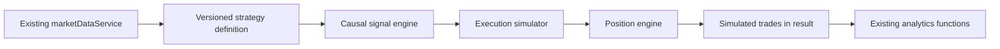

# Backtesting 2.0 — Phase 6

## Start a strategy backtest

1. Configure the existing [Phase 4 historical-data catalog](MARKET_DATA.md) for your authenticated user. Use unadjusted prices and a complete range of up to 5,000 bars. The application never creates missing market data.
2. Confirm the instrument's tick size, multiplier and currency in the existing [instrument specifications](INSTRUMENT_SPECIFICATIONS.md). Equity defaults deliberately do not invent a tick size. Custom specifications use the existing authenticated `POST /api/instrument-specifications` API. For example, a user who has confirmed the appropriate values for their AAPL dataset can supply `{"symbol":"AAPL","assetType":"equity","tickSize":0.01,"contractMultiplier":1,"currency":"USD"}`. These values are a configuration example, not a universal market rule. Existing session/CSRF requirements apply.
3. Open **Backtesting → New strategy backtest**, choose the owned dataset and an ISO timestamp range with UTC `Z` or an explicit offset.
4. Select rules, orders, risk levels, quantity and execution assumptions. Accept the displayed assumptions and save. Run the saved configuration.
5. Read realized statistics, equity, simulated trades, open/pending positions, assumptions and dataset revision together. Generated trades remain in the backtest result; they are never inserted into the journal.

The original SMA editor remains available as **New SMA configuration**. Existing configurations and archived results are preserved. Re-running a legacy configuration uses corrected next-bar execution and opening-gap handling, so its results can legitimately differ from archived proof-of-concept results. The UI identifies archived results and discloses legacy execution policies before running.

## Rule representation

Rules are versioned data, not executable user scripts. The initial language supports a conjunction (`all`) of up to twelve conditions:

- Close above/below EMA, with a configurable period. Seed with the first selected close; wait until the period has been observed.
- Fast/slow SMA crossover above/below, with fast < slow and periods 1–500.
- Strict inside bar: high < previous high and low > previous low. Offset 0 tests the current completed bar against its predecessor; offset 1 tests the previous completed bar against the one before it.
- Declared session: RTH, ETH, premarket, postmarket or daily.

The entry can be market, stop or limit. Stop/limit levels reference the completed signal bar's high/low/close plus an explicit signed offset in price units. Stops use the signal low for longs / high for shorts, fixed price distance, or percentage of absolute slipped entry price. Targets use a multiple of actual initial risk or a percentage of absolute entry price. Optional opposite-SMA-cross exits execute at the next available open.

Example: close above EMA20 AND previous bar inside AND RTH; enter long one confirmed 0.01 price tick above the signal high; stop at signal low; target 2R:

```json
{
  "version": 1,
  "name": "EMA inside-bar breakout",
  "setup": "Inside bar",
  "direction": "long",
  "all": [
    {"type": "ema", "period": 20, "comparison": "above"},
    {"type": "insideBar", "offset": 1},
    {"type": "session", "value": "rth"}
  ],
  "entry": {"type": "stop", "reference": "high", "offset": 0.01},
  "stop": {"type": "signalExtreme"},
  "target": {"type": "rMultiple", "value": 2},
  "exitOnOppositeCross": false
}
```

The offset must match the user's intended instrument. The default editor's zero offset means **at** the signal high, not one tick above it. A session condition applies to the signal bar; allowing pending orders across sessions can permit a fill in a different session. Conditions are evaluated every completed bar; they are not automatically edge-triggered except SMA crosses. A still-true rule can generate another order after an exit, eligible no earlier than the following bar.

## Execution policies

| Topic | Explicit policy |
| --- | --- |
| Market orders | Signal at N close; eligible at N+1 open with adverse slippage. No same-bar-close-to-open fills. |
| Stop entries | Trigger on touch; if the next open is through the trigger, fill at that open plus adverse slippage. |
| Limit entries/targets | Touch fills in full. Opening improvement is allowed. Slippage never makes the price worse than the limit. |
| Quantity/liquidity | One position, no pyramiding/scaling, no partial fills, volume participation, queue priority or capital/margin check. These are acknowledged full-fill assumptions. |
| Order lifetime | Next bar only; expire if not touched. No fill is invented for an order pending at range end. |
| Slippage | Nonnegative whole ticks on entries and exits, including stop, signal, session and end-of-data exits; limit-price protection takes precedence. |
| Commissions | Instrument currency per unit per side; a closed trade pays entry and exit commissions. No FX conversion, borrow fees, funding or additional exchange-fee model. |
| Gaps through protective stops | Actual opening price plus adverse slippage, not a fictitious fill at the stop. Stop/target protection is checked before a queued signal exit. |
| Intrabar ambiguity | Choose `open-low-high-close` or `open-high-low-close`. These are modeled paths, **not observed ticks**. A monotone segment triggers the nearest eligible level first. Entry-bar stops/targets are active only after entry; earlier extremes cannot close a position that did not exist. |
| Invalid post-gap risk | Reject an entry if its stop/target lands on the wrong side of the slipped/rounded entry. Result events disclose the rejection. |
| Tick rounding | Buy market/stop fills round up, sells down. Long stops round down, short stops up; long targets round up, short targets down. Stop entry triggers round away in trigger direction; limit entries remain price-protected. Thus a target can exceed the nominal R slightly after rounding. |
| Session boundaries | Choose carry or flatten at **declared calendar segment ends**. This includes RTH/extended-session segment ends, not just the final trading-date close. Pending orders separately allow or cancel at session/trading-date breaks or declared non-contiguous intervals. |
| End of data | Choose leave open or close at final observed close with costs. End liquidation depends intentionally on the selected horizon and is labeled `endOfData`; it is not a strategy signal. |
| Missing bars | Reject unavailable/partial/incomplete ranges through Phase 4; no skipping or interpolation. Closed-calendar periods are not missing bars. |
| Time | Phase 4 UTC open/close timestamps and explicit calendars determine execution. Dataset exchange timezone/session/tradingDate determine session rules; DST is not inferred from fixed UTC hours. Intrabar fill time is unknown, so it is reported at bar close with an uncertainty label. Holding durations are bar-resolution estimates. |
| Futures rollover | Only explicitly dated single-contract symbols and whole quantities. Use existing contract metadata for tick/multiplier. Reject root/continuous series; no automatic stitching, roll trades or adjustment assumptions. The source owner is responsible for correctly labeling the file's contract. |
| Corporate actions | Adjusted price datasets are rejected. No dividends, split-position adjustment or corporate-action accounting is simulated; choose ranges/instruments appropriate to this limitation. |

A new strategy configuration requires `execution.version: 1` and `accepted: true`. Results retain the actual strategy, assumptions, instrument metadata, engine version, source revision and requested range. Canonical market-data responses now include the calendar from the same described revision as the candles, avoiding a second catalog read during execution. Editing a configuration clears its cached result; an in-flight run cannot overwrite the result of a concurrently edited/deleted configuration.

Legacy SMA configurations preserve their old input units: commission per order side, slippage in price units, multiplier 1. Their disclosed compatibility policy is low-first OHLC, full next-bar fills, carry sessions, pending across sessions allowed, and leave open at end. Their `tickSize: 0.00000001` is a numerical price resolution used by the compatibility adapter, not confirmed instrument tick metadata. Use a versioned strategy for instrument tick rounding, futures and selectable assumptions.

## Determinism and analytics

Architecture:



The signal engine receives one completed candle at a time and retains only the necessary trailing history/indicator state. It has no full-array or future-candle accessor. Prices, fills, commissions, risk and P&L use Decimal arithmetic; deterministic simulation IDs replace random IDs. Same definition + policy + source revision + contract metadata + range produces the same result. Saving `lastRunAt` changes only document metadata outside the simulation result.

Results reuse `computeSummary`, `buildEquityCurve`, `buildDrawdownCurve`, `buildByStrategy` and `buildBySetup`. Reported statistics include Net P&L, Total R, average R, Win Rate, Profit Factor, Expectancy, closed-trade count, realized drawdown and equity. Drawdown is seeded at zero so the first losing trade counts. Undefined statistics remain null; no-loss profit factor is undefined rather than a fabricated finite number. Cash figures are rounded to two decimals and R to three, consistent with current journal analytics.

Open positions appear separately with mark-to-final-close unrealized P&L after entry commission; they are excluded from realized analytics. This is not a mark-to-market equity/drawdown series or portfolio accounting. The initial foundation is one symbol, one direction and one position per run.

## API and persistence

Existing `/api/backtest/configs` CRUD and `/configs/:id/run` routes remain. Version 2 configurations add `engineVersion: 2`, `datasetId`, `strategyDefinition` and `execution`. `BacktestConfig.lastResult` stores generated trades and provenance; no new trade collection or destructive migration is required. Existing backup export/restore includes the additive fields automatically.

Every config query and source/contract lookup uses the authenticated owner. ROOT/ADMIN do not bypass private backtest ownership. Configuration writes allowlist input fields and ignore supplied owner/results/timestamps. Existing CSRF, session, origin and rate-limit protections remain.

No Tortoise AI, live orders, strategy optimization, OR/nested expressions, arbitrary code, portfolio backtests, scale-in/out simulation or continuous-futures rollover was added in Phase 6.
